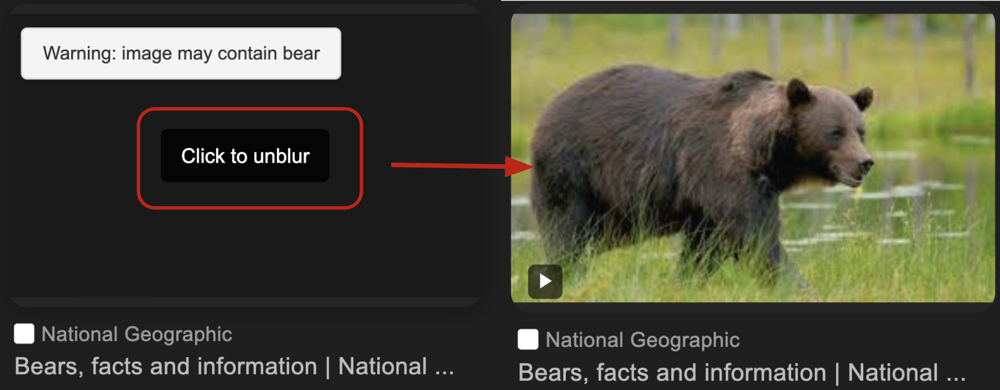

# SafeWeb: AI-Powered Real-Time Content Filter for the Web

This Chrome extension (Manifest v3) lets you browse with custom image filtering: simply enter the keywords you want hidden—say, “bears”, and the add-on combines a lightweight MobileNet V2 model with a fast scan of each image’s alt text and surrounding captions to detect matching content in real time. Images that meet your criteria are automatically blurred, yet you can reveal any of them instantly with a click whenever you choose.

To build the extension, use the command:

```sh
npm build clean
npm i
npm run build
```

To install the unpacked extension in chrome, follow the [instructions here](https://developer.chrome.com/extensions/getstarted).  Briefly, navigate to `chrome://extensions`, make sure that the `Developer mode` switch is turned on in the upper right, and click `Load Unpacked`.  Then select the appropriate directory (the `dist` directory containing `manifest.json`);

If it worked you should see an icon for the `SafeWeb` Chrome extension.


Using the extension
----
After installing the extension, just click its icon and enter your custom keywords as a comma-separated list. You can also enable the “-like” option—so “dog-like,” for example, will blur both dogs and wolves—or switch on the built-in category toggles such as “violence,” which automatically covers related terms like “knife” and “gun.” From that point on, matching images are blurred as the page loads, each with a small warning label summarizing what was detected; if you decide you’d rather see a particular picture, simply click it to reveal the original, much like Instagram’s sensitive-content overlay.




Removing the extension
----
To remove the extension, click `Remove` on the extension page, or use the `Remove from Chrome...` menu option when right clicking the icon.

## Development notes

Here is how the extension works at a high level:

- A [service worker](https://developer.chrome.com/docs/extensions/mv3/migrating_to_service_workers/) `src/service_worker.js` is created that bundles
the TFJS union package and the [mobilenet model](https://github.com/tensorflow/tfjs-models/tree/master/mobilenet). We use a bundler
([parcel](https://parceljs.org/)) to bundle everything together so no external
scripts are loaded at runtime. This is to comply with the requirement of Chrome Extension V3. Note that a service worker can still load external resources
(such as TFJS models).
- Create a context menu item in the service worker that operates on images.
When the menu item is clicked, the image src is sent to the content script for
processing. Note that in a service worker, DOM objects (e.g. Image, document,
etc) are not available.
- After the content script `content.js` receives the image src, it loads the
image, renders the image on an `OffscreenCanvas`, gets the `ImageData` from the
canvas, and sends the data back to the service worker.
- After the service worker receives the image data, it runs the mobilenet model
with the data, and gets the prediction results. It then sends to results back
to the content script for display.
- After the content script receives the results, it overlays the results on top
of the original image.
