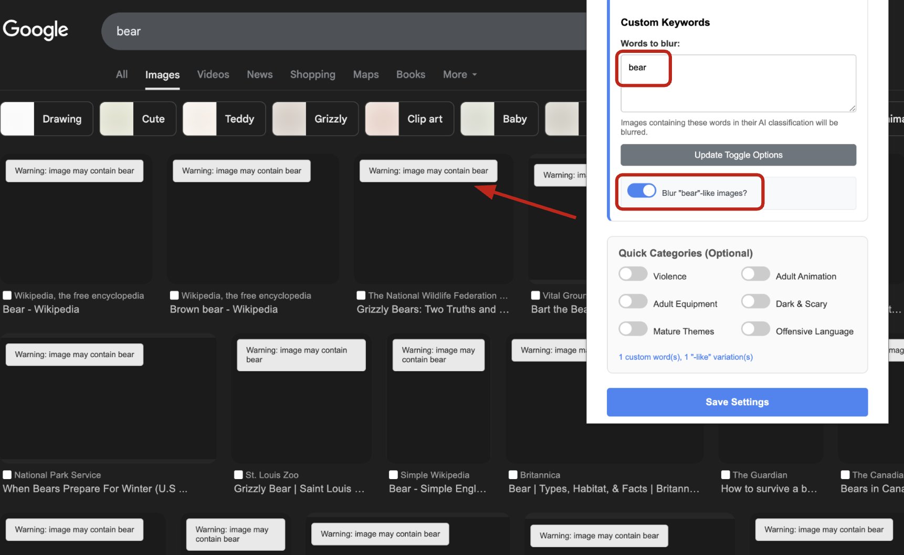

# SafeWeb: AI-Powered Real-Time Content Filter for the Web

This Chrome extension (Manifest v3) lets you browse with custom image filtering: simply enter the keywords you want hidden—say, “bears”, and the add-on combines a lightweight MobileNet V2 model with a fast scan of each image’s alt text and surrounding captions to detect matching content in real time. Images that meet your criteria are automatically blurred, yet you can reveal any of them instantly with a click whenever you choose.

To build the extension, use the command:

```sh
npm run clean
npm i
npm run build
```

Load the Extension into Chrome

1. Open Chrome and go to `chrome://extensions/`
2. Enable **Developer mode** (toggle in the top-right corner)
3. Click the **"Load unpacked"** button
4. Navigate to the project directory and select the `dist/` folder
5. Once loaded, the extension will appear in your toolbar (you may need to **pin** it)

---

## How to Use

1. Click the **puzzle piece icon** 🧩 in your Chrome taskbar
2. **Pin** the **SafeWeb AI** extension for easy access
3. Click the **SafeWeb AI** icon to open its popup window

From here, you can:

- Enter a **comma-separated list of words** that you want to filter (e.g., `snake, blood, spider`)
- Use **toggle switches** to enable predefined categories like:
  - Violence
  - Weapons
  - Insects
  - Animals

> The extension will automatically blur matching images as you browse. No refresh needed!


Using the extension
----
After installing the extension, just click its icon and enter your custom keywords as a comma-separated list. You can also enable the “-like” option—so “dog-like,” for example, will blur both dogs and wolves—or switch on the built-in category toggles such as “violence,” which automatically covers related terms like “knife” and “gun.” From that point on, matching images are blurred as the page loads, each with a small warning label summarizing what was detected; if you decide you’d rather see a particular picture, simply click it to reveal the original, much like Instagram’s sensitive-content overlay.


*Figure&nbsp;1 – Extension popup before any keywords are set*


*Figure&nbsp;2 – Images that match your block list are blurred on load*


*Figure&nbsp;3 – Click to reveal a single image if you change your mind*

Removing the extension
----
To remove the extension, click `Remove` on the extension page, or use the `Remove from Chrome...` menu option when right clicking the icon.

## 🛠️ Development Notes

Here is how the **SafeWeb** Chrome extension works at a high level:

1. **Service Worker Setup**  
   A service worker (`src/service_worker.js`) is responsible for orchestrating the model loading, API interactions, and image classification logic. It bundles:
   - TensorFlow.js (`@tensorflow/tfjs`)
   - The MobileNet model (`@tensorflow-models/mobilenet`)  
   

2. **User Input for Blocklist Terms**  
   Users can enter a **comma-separated list of keywords** directly through the extension popup. These words are stored using `chrome.storage.sync` and dynamically loaded into the service worker.

3. **Predefined Category Toggles**  
   The extension includes toggles for **predefined content categories** (e.g., violence, animals, weapons). When enabled, predefined words for that category are merged into the blocklist.

4. **Blocklist Expansion via Gemini API**  
   Upon initialization and whenever settings are updated, the service worker uses the **Gemini API** to semantically expand each user-supplied blocklist term by finding related or similar concepts from a cleaned master label list.

5. **Image Detection Pipeline**
   - A **content script (`content.js`)** scans the DOM for images and renders each onto an **OffscreenCanvas** to extract raw `ImageData`.
   - This pixel data, along with the image URL and tab ID, is sent to the service worker via `chrome.runtime.sendMessage`.

6. **Image Classification and Decision**
   - The service worker receives the image data, uses the **MobileNet model** to classify the content, and matches the top predictions against the **expanded blocklist**. The image classification is supplemented by a parser that parses the **alt** tags of the images.
   - If any match meets the defined probability threshold, it sends a blur instruction back to the content script.

7. **Blurring and Overlaying**
   - The content script receives the classification result and **blurs** the matching images.


8. **Settings Reload Support**
   - When a user modifies their settings in the popup, the extension sends a `'RELOAD_SETTINGS'` message to the service worker.
   - This triggers reloading the blocklist and notifies all open tabs to **reprocess their images** without requiring a full page reload.

